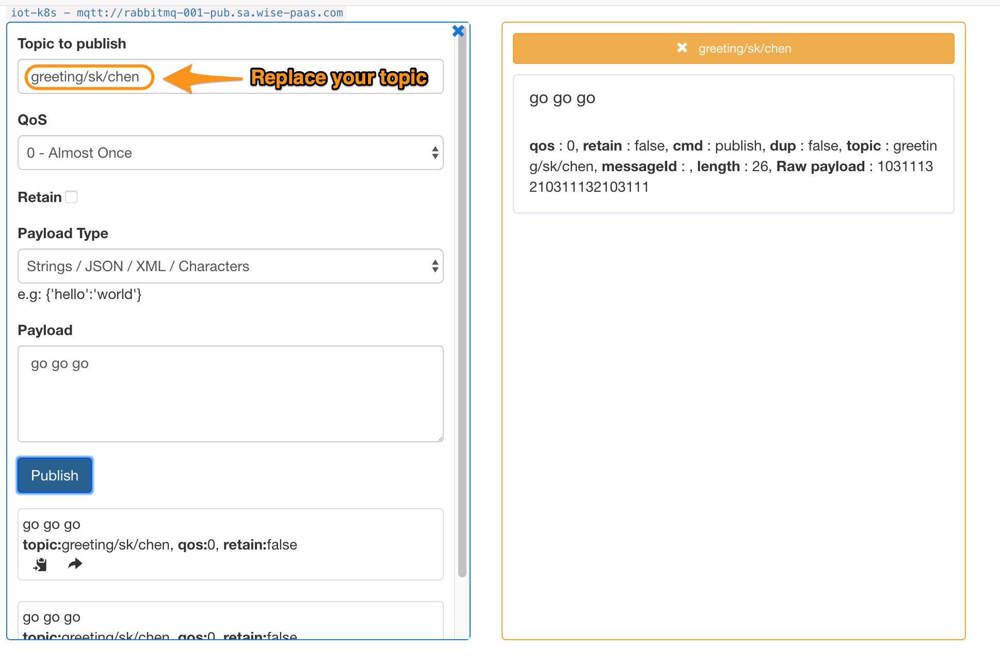
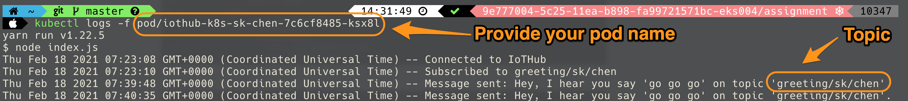

# iothub-k8s-training

# 1. Introduction
Download the sample code to modify the config files and deploy "Iothub-k8s-training" app to assignment namespace

## Modify the config files
- **deployment.yaml**

- **index.yaml**

## Use MQTT to send messages

# 2. Assignment Requirement

Please submit your **Topic** and **Pod name**

