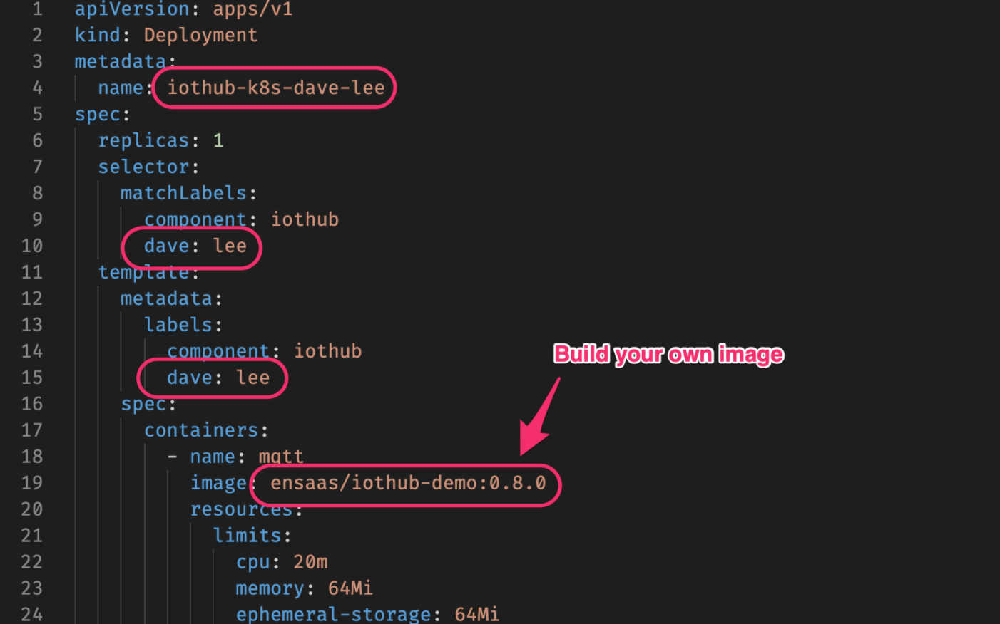
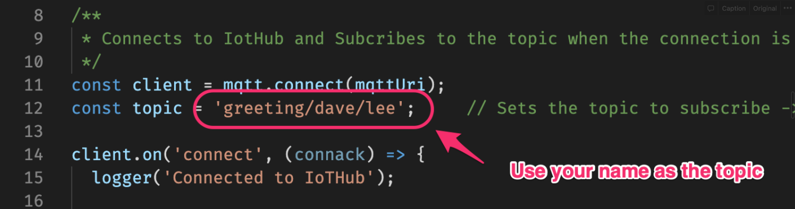

# iothub-k8s-training

# Introduction
Download the sample code to modify the config files and deploy "Iothub-k8s-training" app to assignment namespace according to the example

1. modify the config files
    - **deployment.yaml**

    - **index.yaml**

# Assignment Requirement

Please submit your **Topic** and **Pod name**
